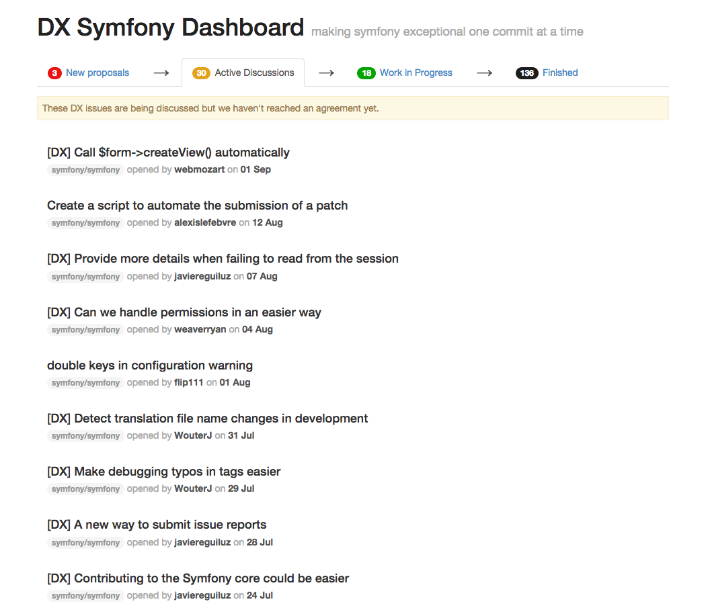

Symfony DX Dashboard
====================

This is a **WORK IN PROGRESS PROJECT**. Please, don't submit any pull request 
to the project for now because we are not ready to accept them yet. Thanks!

-----

Symfony introduced a few weeks ago the [DX Initiative] [1] to improve the
*"developer experience"* when using Symfony and its ecosystem.

During the [Symfony DX Hackdays] [2] we use a shared spreadsheet to track the
progress of each DX issue. This project aims to create a dashboard to easily
manage DX issues.



Installation
------------

```bash
$ cd projects/
$ git clone https://github.com/javiereguiluz/dx.git

$ cd dx/
$ composer install

$ php app/console doctrine:database:create
$ php app/console doctrine:schema:create

$ php app/console issues:find

$ php app/console server:run
```

Now you can browse to `http://127.0.0.1:8000/` to see the Symfony DX Dashboard.

[1]: http://symfony.com/blog/making-the-symfony-experience-exceptional
[2]: http://symfony.com/blog/expanding-the-dx-initiative-hack-day-2-aug-23rd
